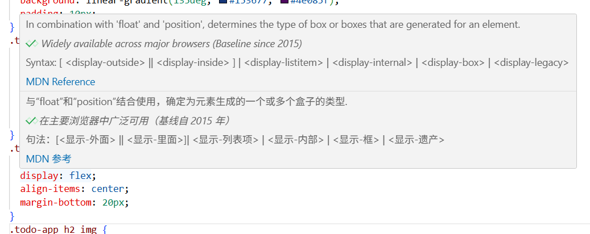
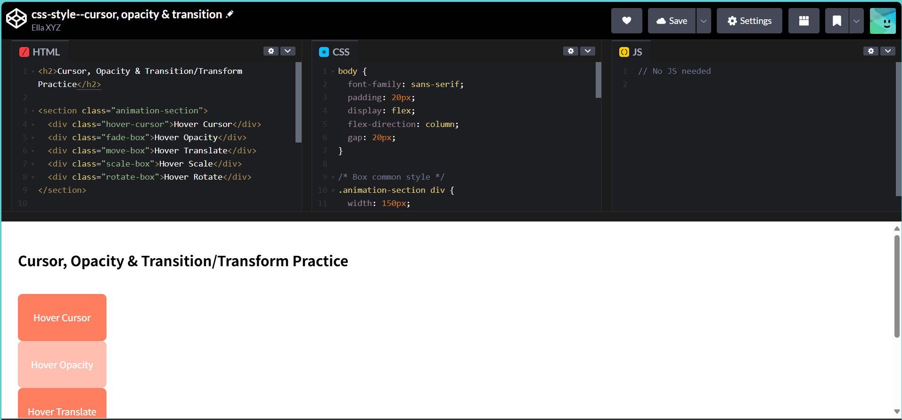

# 前端学习笔记（AI 时代的公开学习示例）

[README - English Version](./README.md)

欢迎来到我的前端学习笔记，这是一个在 **AI 时代** 的公开学习笔记示例。

如果你在 **2025 年** 开始或继续学习前端开发技术，并希望更新自己的学习方式，可以参考、**Fork**，但是不鼓励照搬思路。

如果这个仓库对你有帮助，欢迎点一个 ⭐️ **Star**！

[什么是 Fork 和 Star？](https://www.cnblogs.com/bibi-feiniaoyuan/p/9519467.html)

学习原则

- 项目驱动、公开学习、教学相长
- 追求简单、与时俱进、以人为本
- 充分与 AI 协作
- 获得启发、提高审美

我的理解

- **项目驱动**  
  从完整项目出发，在实践中学习，避免围绕语法或教程学习。

- **公开学习、教学相长**  
  在相关话题、社群、网站到处刷存在感——写博客、出教学视频、分享过程。

- **追求简单**  
  学习最终会来到“看山还是山”的阶段，回归本质。

- **与时俱进**  
  保持技术栈更新，跟上前端发展节奏。

- **以人为本**  
  太多代码服务于商业目的而忽视人的需求。  
  至少在个人学习与开发时，不忘技术应服务于人。

- **获得启发**  
  寻找并关注能启发自己的前辈。  
  启发不是“解答已提出的问题”，是*让人提出原本没有想到的问题*。

- **提高审美**  
  在 AI 时代，生产力、单一技能或工作经验的性价比逐年递减。  
  提高审美趣味正成为个人差异化竞争的关键。

## 项目里程碑

2025-10-29 - 完成 project1.1-1.6，开始项目阶段 2: 使用框架和各种组件

2025-10-24 - 创建上传这个项目并完成 README.md

## 快照

(方便之后快速回顾)

### 项目回顾

Project 1.1 - 1.6：仅使用 HTML + CSS + JS

  

    
    
Project 1.1

  

  

    
    
Project 1.2

  

  

    
    
Project 1.3

  

  

    
    
Project 1.4

  

  

    
    
Project 1.6

  

### 开发工具

主要工具: [VS Code](https://code.visualstudio.com/), [Markdown](https://www.markdownguide.org/basic-syntax/)

VScode 插件：
[Prettier](https://marketplace.visualstudio.com/items?itemName=esbenp.prettier-vscode),
[Live Server](https://marketplace.visualstudio.com/items?itemName=ritwickdey.LiveServer),
[Comment Translate](https://marketplace.visualstudio.com/items?itemName=intellsmi.comment-translate)

### Debug 调试

[在 Edge 浏览器中调试](https://learn.microsoft.com/en-us/microsoft-edge/devtools/javascript/)

### Playground

[CodePen——交互式练习 HTML, CSS 和 JS](https://codepen.io/)

## 🔗 链接（尽可能少）

**最好的文档**

- [MDN Web Docs（HTML / CSS / JS）](https://developer.mozilla.org/)
- [React 官方文档](https://react.dev/)
  = [TypeScript 官方手册](https://www.typescriptlang.org/docs/handbook/intro.html)

**AI 助手**

- [ChatGPT](https://chatgpt.com/)

**获得启发**

- [Sharyap](https://www.sharyap.com/) 插画 | 网页设计 | Youtuber
- [Wayback Machine](https://web.archive.org/) 记录过去的网站页面
- [Ang’s Corner](https://angs-corner.nekoweb.org/) 手账样式，超酷的独立网站

**提高审美**

- [Google 的设计框架，配色大胆](https://m3.material.io/get-started)
- [Apple 的设计指南](https://developer.apple.com/design/human-interface-guidelines/)
- [中文文案排版指北](https://mazhuang.org/wiki/chinese-copywriting-guidelines/)
