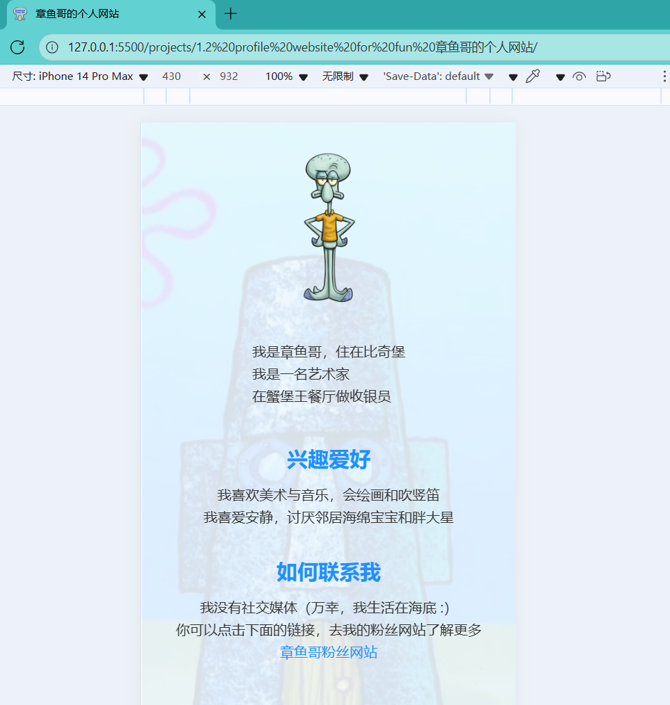
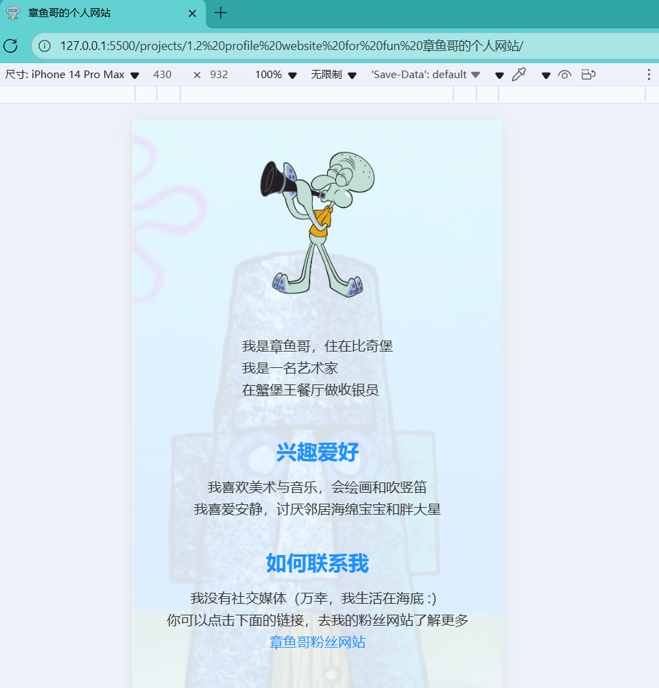

# simple profile website

To practice **HTML, CSS, and JavaScript** by implementing a simple profile website for Squidward Tentacles.

 Click on the profile image-->


[Who???](https://spongebob.fandom.com/wiki/Squidward_Tentacles)

## Project Structure

```
├─ index.html
├─ style.css
└─ index.js
```

## How to Re-build

HTML Structure: Build header with profile image + about section, main content (hobbies + contact), and footer. Include meta tags, title, favicon, and CSS link.

CSS Styling: Apply global reset, Flexbox for header layout, center main sections, style text, links, and add a semi-transparent background image.

JavaScript: Animate profile image floating, implement hover blinking effect, and cycle through avatars on click.

## Prompt to AI

```txt
Create a simple personal webpage for a cartoon character.
Requirements:
- Header with profile image and a short "About Me" section side by side.
- Main content with "Hobbies" and "Contact" sections.
- Footer with copyright.
- Floating animation effect for the profile image.
- Hover effect that makes the image gently blink.
- Click on profile image to cycle through multiple avatars.
- Background image with low opacity behind all content.
- Use clean HTML, CSS, and vanilla JavaScript.
- Responsive layout with Flexbox for header and centered main sections.
- Include example images and placeholder text.
Output all files: index.html, style.css, index.js, ready to run in a browser.
```
