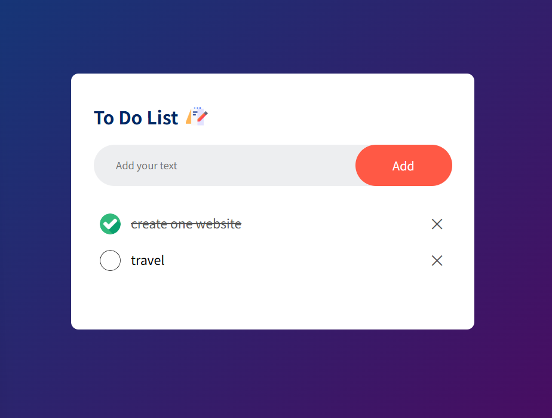

# todo-list webpage

To practice **HTML, CSS, and JavaScript** by implementing a simple todo list webpage with saving state function.



## Project Structure

```
├─ index.html
├─ style.css
└─ script.js
```

## How to Re-build

HTML Structure:
Create a centered container with a header (title + notebook icon), an input row (text box + “Add” button), and an unordered list to display tasks. Include proper meta tags, title, favicon, and link to the external CSS and JS files.

CSS Styling:
Apply a global reset and Poppins font. Use a blue–purple linear gradient background with a white rounded task box centered on the page. Style the input row using Flexbox, design the add button in orange-red, and position a red “×” delete icon on each task. Include hover effects for buttons and delete icons.

JavaScript:
Implement task creation, check/uncheck toggle, and delete functionality. Save and restore tasks with their checked state using localStorage. Add event listeners for clicks on tasks and delete icons, and auto-refresh the displayed list on page load.

## Prompt to AI

```txt
Build a simple responsive Todo List web app using HTML, CSS, and vanilla JavaScript.
It should let users add, check/uncheck, and delete tasks.
Tasks and their checked state must be saved in localStorage.
Use a gradient background, centered white todo box, Poppins font, and clear red delete (×) buttons.
Deliver index.html, style.css, and script.js — fully working code, same behavior as a classic Todo List.
```
