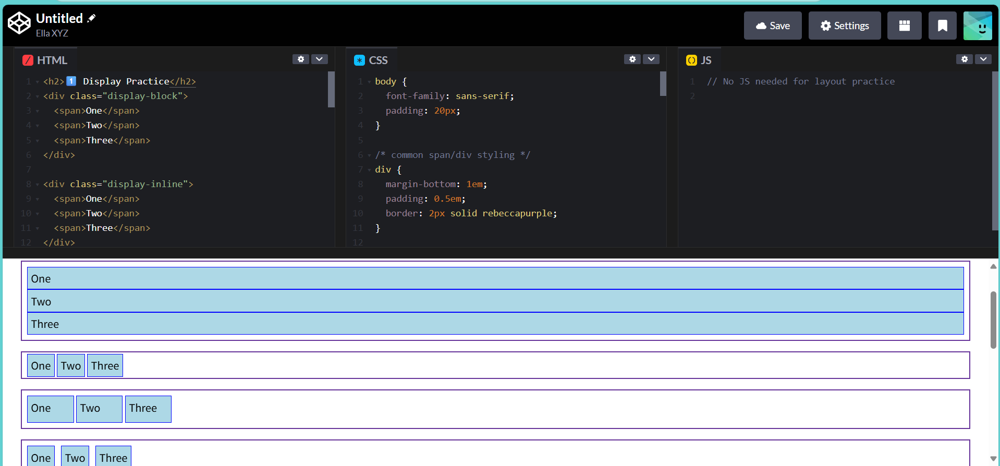

# CSS 三层模型练习笔记

为了练习 CSS，我总结了 **盒模型、布局、样式修饰** 三层模型，并搭建了一系列 CodePen 小练习，分主题练习：

- **样式修饰（Styling）** ← 颜色 / 阴影 / 动画
- **布局（Layout）** ← 排列方式 / 定位 / 对齐
- **盒模型（Box Model）** ← 自身大小 / 边距 / 边框

> 盒模型决定「你是谁」，布局决定「你在哪」，样式修饰决定「你长什么样」

[CodePen——A playground for HTML, CSS, and JS](https://codepen.io/)

## 一、盒模型层（Box Model）

| 属性                                                    | 功能                         | 备注                       | 链接                                                             |
| ------------------------------------------------------- | ---------------------------- | -------------------------- | ---------------------------------------------------------------- |
| `width` / `height`                                      | 设置内容区域宽高             | 最常用尺寸属性             | [练习 Size & Sizing](https://codepen.io/pen?template=LEGBVJL)    |
| `box-sizing`                                            | 决定盒子计算方式             | 建议固定为 `border-box`    | ↑ 同上                                                           |
| `max-width` / `min-width` / `max-height` / `min-height` | 限制尺寸范围                 | 响应式布局常用             | ↑ 同上                                                           |
| `padding`                                               | 内边距（内容与边框之间）     | 可单独设置四边             | [练习 Spacing & Border](https://codepen.io/pen?template=azdjOKm) |
| `margin`                                                | 外边距（元素与其他元素间距） | 可用 `auto` 居中           | ↑ 同上                                                           |
| `border` / `border-radius`                              | 边框与圆角                   | `border: 1px solid #000;`  | ↑ 同上                                                           |
| `overflow`                                              | 控制溢出内容                 | `hidden`、`scroll`、`auto` | [练习 Overflow](https://codepen.io/pen?template=emJjNPp)         |
| `box-shadow`                                            | 投影效果                     | 视觉增强                   | [练习 Box-shadow](https://codepen.io/pen?template=MYKBwzw)       |

## 二、布局层（Layout）

| 属性组合                             | 功能               | 备注                                                               | 链接                          |
| ------------------------------------ | ------------------ | ------------------------------------------------------------------ | ----------------------------- |
| `display`                            | 决定元素的布局模式 | 理解 `block` / `inline` / `flex` / `grid`                          | [练习 Display]()              |
| `flex` 系列                          | 弹性布局核心       | 合并练习：`justify-content`、`align-items`、`flex-wrap`、`gap`     | ↑ 同上                        |
| `grid` 系列                          | 网格布局核心       | 合并练习：`grid-template-columns`、`grid-template-rows`、`gap`     | ↑ 同上                        |
| `position` + `top/right/bottom/left` | 控制定位与坐标     | 合并练习，理解 `static`、`relative`、`absolute`、`fixed`、`sticky` | [练习 Position & Top/Left](#) |
| `z-index`                            | 控制层叠顺序       | 建议和 `position` 一起练习                                         | ↑ 同上                        |

## 三、样式修饰层（Style / Visuals）

| 属性                                                        | 功能           | 备注                          | 链接                                                                                    |
| ----------------------------------------------------------- | -------------- | ----------------------------- | --------------------------------------------------------------------------------------- |
| `color` / `background`                                      | 文本与背景色   | `background` 可叠加渐变或图片 | [练习 Color & Background & Font & Text](https://codepen.io/pen?template=raxrOaW)        |
| `font-size` / `font-family` / `font-weight` / `line-height` | 字体排版       | 页面可读性的基础              | ↑ 同上                                                                                  |
| `text-align` / `vertical-align` / `text-decoration`         | 文本对齐与修饰 | 常见于标题与段落              | ↑ 同上                                                                                  |
| `cursor`                                                    | 鼠标指针样式   | UI 反馈常用                   | [练习 Cursor & Opacity & Transition/Transform](https://codepen.io/pen?template=ZYQjbGO) |
| `opacity`                                                   | 透明度         | 常配合 hover 效果             | ↑ 同上                                                                                  |
| `transition` / `transform`                                  | 动画与过渡     | 常见于按钮 hover              | ↑ 同上                                                                                  |
| `filter` / `backdrop-filter`                                | 滤镜效果       | 模糊玻璃效果等                | [练习 Filter](https://codepen.io/pen?template=jEWpbWP)                                  |
| `clip-path` / `mask`                                        | 裁剪与遮罩     | 进阶视觉特效                  | [练习 Clip-path / Mask](https://codepen.io/pen?template=raxrOLy)                        |
