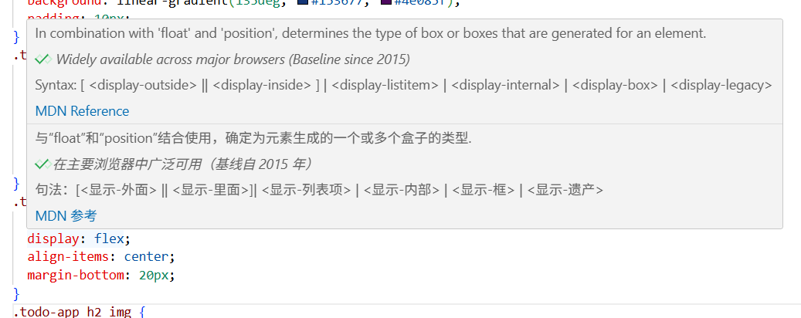

# CSS 三层模型练习笔记

为了练习 CSS，我总结了 **盒模型、布局、样式修饰** 三层模型，并搭建了一系列 CodePen 小练习，分主题练习：

- **样式修饰（Styling）** ← 颜色 / 阴影 / 动画
- **布局（Layout）** ← 排列方式 / 定位 / 对齐
- **盒模型（Box Model）** ← 自身大小 / 边距 / 边框

> 盒模型决定「你是谁」，布局决定「你在哪」，样式修饰决定「你长什么样」

## 快照

(方便之后快速回来回顾)

- VScode 插件[Comment Translate](https://marketplace.visualstudio.com/items?itemName=intellsmi.comment-translate)  
  鼠标悬停时的注释自动翻译  
  

## 一、盒模型层（Box Model）

| 属性                                                    | 功能                         | 备注                       | 链接                                                         |
| ------------------------------------------------------- | ---------------------------- | -------------------------- | ------------------------------------------------------------ |
| `width` / `height`                                      | 设置内容区域宽高             | 最常用尺寸属性             | [练习 Width/Height](https://codepen.io/pen?template=ZYQRxbL) |
| `padding`                                               | 内边距（内容与边框之间）     | 可单独设置四边             | [练习 Padding]()                                             |
| `margin`                                                | 外边距（元素与其他元素间距） | 可用 `auto` 居中           | [练习 Margin]()                                              |
| `border` / `border-radius`                              | 边框与圆角                   | `border: 1px solid #000;`  | [练习 Border]()                                              |
| `box-sizing`                                            | 决定盒子计算方式             | 建议固定为 `border-box`    | [练习 Box-sizing]()                                          |
| `overflow`                                              | 控制溢出内容                 | `hidden`、`scroll`、`auto` | [练习 Overflow]()                                            |
| `max-width` / `min-width` / `max-height` / `min-height` | 限制尺寸范围                 | 响应式布局常用             | [练习 Max/Min]()                                             |
| `box-shadow`                                            | 投影效果                     | 视觉增强                   | [练习 Box-shadow]()                                          |

## 二、布局层（Layout）

| 属性                                | 功能               | 备注                                                 | 链接                |
| ----------------------------------- | ------------------ | ---------------------------------------------------- | ------------------- |
| `display`                           | 决定元素的布局模式 | `block`、`inline`、`flex`、`grid`                    | [练习 Display]()    |
| `position`                          | 控制定位方式       | `static`、`relative`、`absolute`、`fixed`、`sticky`  | [练习 Position]()   |
| `top` / `right` / `bottom` / `left` | 定位坐标           | 搭配 `position` 使用                                 | [练习 Top/Left]()   |
| `flex` 系列                         | 弹性布局核心       | `justify-content`、`align-items`、`flex-wrap`、`gap` | [练习 Flex]()       |
| `grid` 系列                         | 网格布局核心       | `grid-template-columns`、`grid-template-rows`、`gap` | [练习 Grid]()       |
| `float` / `clear`                   | 旧式布局           | 理解概念即可                                         | [练习 Float]()      |
| `z-index`                           | 控制层叠顺序       | 需要配合定位使用                                     | [练习 Z-index]()    |
| `align-self` / `justify-self`       | 子项在布局内的对齐 | 在 flex / grid 中使用                                | [练习 Align-self]() |

## 三、样式修饰层（Style / Visuals）

| 属性                                                        | 功能           | 备注                          | 链接                          |
| ----------------------------------------------------------- | -------------- | ----------------------------- | ----------------------------- |
| `color` / `background`                                      | 文本与背景色   | `background` 可叠加图像或渐变 | [练习 Color/Background]()     |
| `font-size` / `font-family` / `font-weight` / `line-height` | 字体排版       | 页面可读性的基础              | [练习 Font]()                 |
| `text-align` / `vertical-align` / `text-decoration`         | 文本对齐与修饰 | 常见于标题与段落              | [练习 Text]()                 |
| `cursor`                                                    | 鼠标指针样式   | UI 反馈常用                   | [练习 Cursor]()               |
| `opacity`                                                   | 透明度         | 常配合 hover 效果             | [练习 Opacity]()              |
| `transition` / `transform`                                  | 动画与过渡     | 常见于按钮 hover              | [练习 Transition/Transform]() |
| `filter` / `backdrop-filter`                                | 滤镜效果       | 模糊玻璃效果等                | [练习 Filter]()               |
| `clip-path` / `mask`                                        | 裁剪与遮罩     | 进阶视觉特效                  | [练习 Clip-path]()            |
