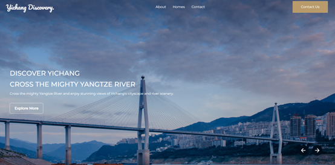
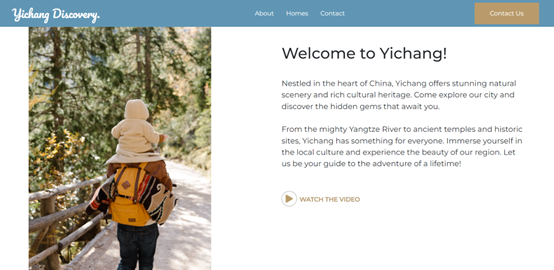
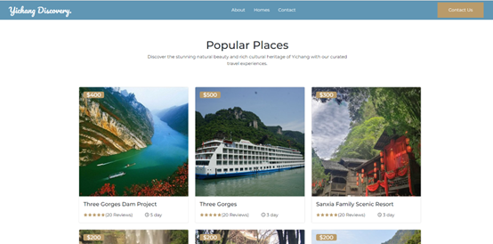
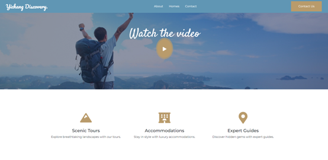

# Yichang Travel Website

铛铛铛，来到阶段 2 啦，开始使用前端框架和各种组件！

项目 **2.1** 是一个基于 **React** 和 **Bootstrap** 的旅游预订网站前端示例，虽然只有一个网页，但基本要素齐全：

- 响应式布局，兼容移动端和桌面端
- 轮播图
- 旅游套餐和信息展示，部分小图使用的其他城市的
- 使用 Google Fonts (`Montserrat`, `Satisfy`, `Pacifico`) 字体

 | 

 | 

> 注意：这是我两年前写的一个网页，[点击查看：以前的 repo](https://github.com/xiangyi-zhou/Travel-Booking-Website)，目前可能有更好用的新组件，比如轮播组件的用法我已经更新，其他内容暂时不更新

## 在线演示

[https://yichang-travel.netlify.app/](https://yichang-travel.netlify.app/)

几年前读书时部署的，后续不会维护

## 重新构建项目

为了学习，建议重新构建该项目，复制对应文件夹，先从修改局部开始熟悉组件使用，熟悉后再从 0 开始复刻。

- 新建

```bash
npx create-react-app yichang-travel
```

- 复制旧的 `src` 文件夹

- 复制旧的 `public` 文件夹

- 安装依赖

新项目从 0 安装依赖

```bash
npm install react react-dom react-router-dom react-scripts bootstrap react-bootstrap styled-components react-icons magnific-popup react-multi-carousel react-owl-carousel react-slick slick-carousel react-sticky-nav react-video-js-player
```

或者直接复制 package.json

```bash
npm install
```

- 本地测试

```bash
npm start
```

浏览器打开 [http://localhost:3000](http://localhost:3000) 查看效果

- 打包生产环境

```bash
npm run build
```

打包后的文件会生成在 `build/` 文件夹，可用于部署到服务器或静态托管。

## 链接

- [React.js](https://reactjs.org/)
- [Bootstrap](https://getbootstrap.com/)
- [React Slick](https://react-slick.neostack.com/)
- [React Icons](https://react-icons.github.io/react-icons/)
- [Styled Components](https://styled-components.com/)

声明：本项目仅供学习和个人使用
